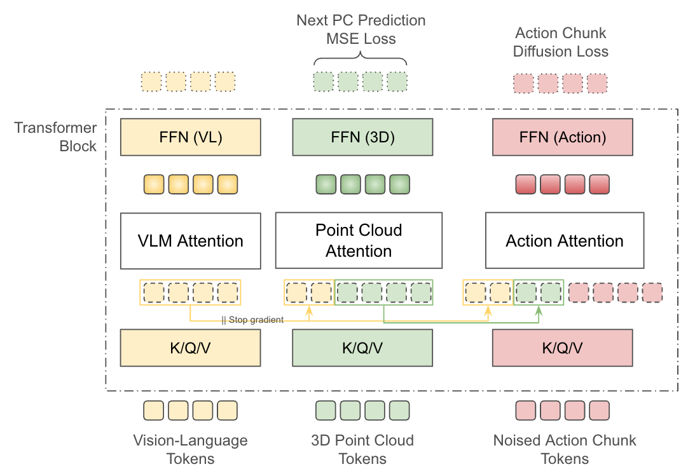

# Toward NT0

## Single-Backbone Multi-Expert Architecture

<div class="text-sm opacity-75 mt-8">
Qwen2.5-VL · Point-Cloud Expert · Action Flow-Matching Expert
</div>

<div class="pt-12">
  <span class="px-4 py-2 rounded accent-pill">
    Team members: Mohammad, Andri, and Artem
  </span>
</div>

---
layout: two-cols
---

# Core Idea — VLM Expert

The frozen VLM expert is the **actual** `Qwen2_5_VLDecoderLayer` — not a conversion or approximation.

It retains its native:

- 3D **MRoPE**
- **RMSNorm**
- **GQA** (16 Q / 2 KV)
- Causal + packed-sequence attention mask
- Sliding-window layers

VLM runs at **every** backbone layer. Its K/V (post-RoPE) are extracted from `DynamicCache` and passed to downstream experts with `.detach()`.

::right::

# PC & Action Experts

<br>

`ExpertBlock` = downsized transformer block that matches the VLM's architectural primitives at reduced width.

| Primitive | Status |
|-----------|--------|
| RMSNorm | ✓ shared |
| GatedMLP | ✓ shared |
| GQA | ✓ shared |
| MRoPE | ✓ shared |

Initialized from VLM weights by **slicing the first N heads** and **truncating MLP dimensions**.

---
layout: default
---

# Placement Modes

Experts are placed at configurable layers (`expert_layer_ids`). Two modes control behavior at *non-expert* layers:

<br>

<div grid="~ cols-2 gap-6">

<div class="p-4 border rounded">

## Dense

Experts exist at **every** layer.

- **Cross-attention to VLM**: only at `expert_layer_ids`
- **Self-attention only**: at other layers

Full-depth processing with selective cross-modal flow.

</div>

<div class="p-4 border rounded">

## Sparse

Experts exist **only** at `expert_layer_ids`.

- Hidden states **pass through unchanged** at other layers

Trainable params proportional to number of expert layers.

</div>

</div>

---
layout: default
---

# Conditioning Paths

Each signal enters the model through **one or two paths**:

| Signal | Token sequence | adaLN (Action only) |
|--------|---------------|---------------------|
| Camera images (×K) | VLM: `<vision_start>…<vision_end>` per cam | — |
| Task instruction | VLM: text `<task>…</task>` | — |
| Robot description | VLM: text `Robot: …` | — |
| Embodiment ID | PC + Action: `SharedEmbodimentEmbedding` → `embod_pc`, `embod_action` | — |
| Attention sinks | PC: `sink_pc`; Action: `sink_action` (separate `nn.Parameter`s at position 0) | — |
| Point clouds (×K) | PC: `<pc_(wrist_)start>…<pc_(wrist_)end>` per cam | — |
| Alignment flag | PC: `<align>` → `Embedding(2)[0 or 1]` | — |
| Proprio (P × 10) | Action: `<proprio_start>` `ProprioEncoder(proprio)` `<proprio_end>` | — |
| Noisy action chunk | Action: `<action_start>…<action_end>` | — |
| Timestep `t` | — | `TimestepEmbedding(t)` |

---
layout: default
---

# Conditioning — Proprio

## Proprio → Action-stream tokens

- Each proprio reading (current, or current + history) is projected by a single shared `Linear(proprio_dim, d_action)` in `ProprioEncoder`.
- Wrapped in `<proprio_start>` / `<proprio_end>` learned delimiters and prepended to the action chunk inside the Action expert.
- A unified causal mask covers `[<proprio_start>, proprio, <proprio_end>, <action_start>, action, <action_end>]` so action tokens attend back to proprio while staying causal among themselves; the delimiters give the model a learned cue for the proprio block boundary even when P varies sample to sample.

---
layout: default
---

# Conditioning — Embodiment

## Embodiment → shared bottleneck across PC + Action

- One `nn.Embedding(NUM_ROBOTS=3, d_emb)` base + two zero-init `Linear(d_emb, d_*, bias=False)` heads in `SharedEmbodimentEmbedding`.
- `embodiment_pc` lands at **position 1 of the PC segment** (`sink_pc` occupies position 0); `embodiment_action` at position 1 of the Action segment.
- Both losses train the same base via the two projections; Action loss also reaches `to_pc` indirectly through the no-detach PC→Action cross-attention.
- The frozen VLM still gets per-robot context via the **textual** `Robot: {description}` line — no learned token in the VLM segment.

---
layout: default
---

# Conditioning — Attention Sinks

## Attention sinks → two separate Parameters

- `sink_pc` and `sink_action` (separate `nn.Parameter`s at width `d_pc` and `d_action`) sit at **position 0** of each segment, ahead of embodiment.
- Their job is to absorb softmax mass that heads can't usefully place — Xiao et al. 2023, applied per-expert.
- **Not shared**: PC bidirectional and Action causal have independent "good sink" directions; sharing weights would constrain a content-free Parameter for no gain.
- `sink_pc` also drains Action's cross-attention to PC K/V — double duty for free.

<br>

<div class="text-sm opacity-75">

`AdaLNConditioner` is **timestep only** — embodiment and proprio-history adaLN paths are gone.

</div>

---
layout: default
class: tight-code
---

# Token Sequence

Three segments with separate widths (`d_vlm`, `d_pc`, `d_action`), assembled by `SequenceBuilder`. Each token carries a type label in `{vlm, pc, action}`.

```text
┌───────────────────────────────────────────────────────────────────┐
│  VLM segment (rho = vlm, width = d_vlm)                           │
│                                                                   │
│  <|im_start|>system ... <|im_end|>                                │
│  <|im_start|>user                                                 │
│    <|vision_start|><|image_pad|>xN<|vision_end|>     cam 1 image  │
│    <|vision_start|><|image_pad|>xN<|vision_end|>     cam 2 image  │
│    <|vision_start|><|image_pad|>xN<|vision_end|>     cam 3 image  │
│    Robot: {description}                                           │
│    <task>{instruction}</task>                                     │
│  <|im_end|>                                                       │
│  <|im_start|>assistant                                            │
├───────────────────────────────────────────────────────────────────┤
│  PC segment (rho = pc, width = d_pc)                              │
│                                                                   │
│  sink_pc                        attention sink (Xiao et al. '23)  │
│  embodiment_pc                  from SharedEmbodimentEmbedding    │
│  <align>                                                          │
│  <pc_start> pc_cam1_tok_1 ... pc_cam1_tok_M <pc_end>     base cam │
│  <pc_start> pc_cam2_tok_1 ... pc_cam2_tok_M <pc_end>     base cam │
│  <pc_wrist_start> pc_cam3 ... pc_cam3_tok_M <pc_wrist_end>  wrist │
├───────────────────────────────────────────────────────────────────┤
│  Action segment (rho = action, width = d_action)                  │
│                                                                   │
│  sink_action                    attention sink (Xiao et al. '23)  │
│  embodiment_action              from SharedEmbodimentEmbedding    │
│  <proprio_start> proprio_tok_1 ... proprio_tok_P <proprio_end>    │
│  <action_start>  act_tok_1     ...    act_tok_T  <action_end>     │
└───────────────────────────────────────────────────────────────────┘
```

---
layout: default
---

# Token Sequence — Notes

**Not** in the token sequence — enter through adaLN only:

- Timestep embedding (sole adaLN signal)

<br>

For `K` cameras: VLM prompt has **K** image blocks and PC segment has **K** PC blocks — **one-to-one correspondence**.

Each camera is bracketed by `<pc_start>` / `<pc_end>` (non-wrist) **or** `<pc_wrist_start>` / `<pc_wrist_end>` (wrist), selected by a per-camera `is_wrist` flag passed to `SequenceBuilder`. Within each class the embeddings are **shared across cameras**, the same way Qwen-VL shares `<|vision_start|>` / `<|vision_end|>` across images. Wrist delimiters apply to the **PC segment only** — VLM-side wrist tokens are deferred to Phase 2 (VLM stays frozen).

---
layout: default
class: tighter-code
---

# Concrete Layout — 3 cameras (2 base + 1 wrist), 3 point clouds

What the Mixture-of-Transformers actually sees in one batch element.

```text
═════════════════════════════════════════════════════════════════════════════
 VLM SEGMENT       rho = vlm     width d_vlm = 2560 (Qwen3-VL-4B-Instruct)
 ~700 tokens for K=3 cams (n_img ~196 merged ViT patches per image)
═════════════════════════════════════════════════════════════════════════════
   <|im_start|>system  …system prompt tokens…  <|im_end|>
   <|im_start|>user
       <|vision_start|>  <|image_pad|>×n_img  <|vision_end|>     ← base cam 1
       <|vision_start|>  <|image_pad|>×n_img  <|vision_end|>     ← base cam 2
       <|vision_start|>  <|image_pad|>×n_img  <|vision_end|>     ← wrist cam 3
       Robot: {description}
       <task>{instruction}</task>
   <|im_end|>
   <|im_start|>assistant
═════════════════════════════════════════════════════════════════════════════
 PC SEGMENT        rho = pc      width d_pc = 1024
 length = 3 + K(M+2) = 3 + 3·(M+2)  e.g. M=128 → 393 tokens
═════════════════════════════════════════════════════════════════════════════
   [0]      sink_pc                       attention sink (learnable param)
   [1]      embodiment_pc                 SharedEmbodimentEmbedding.to_pc(rid)
   [2]      <align>                       AlignmentToken(0|1)·d_pc
   [3]      <pc_start>                    ┐
   [4..]    pc_cam1_tok_1 … pc_cam1_tok_M │  cam 1 BASE  (Uni3D output)
   [.]      <pc_end>                      ┘
   [.]      <pc_start>                    ┐
   [..]     pc_cam2_tok_1 … pc_cam2_tok_M │  cam 2 BASE
   [.]      <pc_end>                      ┘
   [.]      <pc_wrist_start>              ┐
   [..]     pc_cam3_tok_1 … pc_cam3_tok_M │  cam 3 WRIST  (separate delimiters)
   [.]      <pc_wrist_end>                ┘
═════════════════════════════════════════════════════════════════════════════
 ACTION SEGMENT    rho = action  width d_action = 1024
 length = P + T + 6   e.g. P=1, T=30 → 37 tokens
═════════════════════════════════════════════════════════════════════════════
   [0]      sink_action                   attention sink (learnable param)
   [1]      embodiment_action             SharedEmbodimentEmbedding.to_action(rid)
   [2]      <proprio_start>
   [3..]    proprio_tok_1 … proprio_tok_P ProprioEncoder(state)  ← variable P
   [P+3]    <proprio_end>
   [P+4]    <action_start>
   [P+5..]  ã_t  …  ã_{t+T-1}             noised actions  ã^τ = τ·a + (1-τ)·ε
   [P+T+5]  <action_end>
═════════════════════════════════════════════════════════════════════════════
```

<div class="text-xs opacity-75 pt-2">

**Self-attention per segment**: VLM causal (Qwen native); PC bidirectional; Action causal. **Cross-attention at expert layers**: PC reads VLM K/V (detached); Action reads VLM K/V (detached) + PC K/V (gradient flows). **adaLN** (DiT zero-init, 6 mod params) modulates the Action expert from the timestep only.

</div>

---
layout: default
---

# Special Tokens

Follows Qwen-VL's delimiter pattern: delimiter tokens wrap each segment, pad tokens are replaced by encoder features.

```text
Qwen-VL images:    <|vision_start|>    <|image_pad|>xN  <|vision_end|>          per camera
PC (non-wrist):    <|pc_start|>        <|pc_pad|>xM     <|pc_end|>              per non-wrist cam
PC (wrist):        <|pc_wrist_start|>  <|pc_pad|>xM     <|pc_wrist_end|>        per wrist cam
Proprio block:     <|proprio_start|>   proprio_tokens   <|proprio_end|>         wraps P proprio tokens (variable)
Our actions:       <|action_start|>    action_tokens    <|action_end|>
```

<br>

| Token | Expert | Shared across cams | Purpose |
|-------|--------|--------------------|---------|
| `sink_pc` | PC | one per sample | Learnable attention sink at PC position 0; drains softmax mass |
| `sink_action` | Action | one per sample | Learnable attention sink at Action position 0; drains softmax mass |
| `embodiment_pc` | PC | one per sample | Per-robot token from `SharedEmbodimentEmbedding.to_pc`; PC position 1 |
| `embodiment_action` | Action | one per sample | Per-robot token from `SharedEmbodimentEmbedding.to_action`; Action position 1 |
| `<\|pc_start\|>` | PC | ✓ within non-wrist | Start of a non-wrist camera's PC |
| `<\|pc_end\|>` | PC | ✓ within non-wrist | End of a non-wrist camera's PC |
| `<\|pc_wrist_start\|>` | PC | ✓ within wrist | Start of a wrist-camera PC |
| `<\|pc_wrist_end\|>` | PC | ✓ within wrist | End of a wrist-camera PC |
| `<\|proprio_start\|>` | Action | one per sample | Start of the variable-length proprio block |
| `<\|proprio_end\|>` | Action | one per sample | End of the variable-length proprio block |
| `<\|action_start\|>` | Action | N/A | Start of action chunk |
| `<\|action_end\|>` | Action | N/A | End of action chunk |
| `<align>` | PC | one per sample | `Embedding(2, d_pc)` — 0=unaligned, 1=aligned |

---
layout: default
---

# Supported Embodiments

<br>

| Robot | Description | DOF |
|-------|-------------|-----|
| **Trossen** | 7-DOF Trossen arm with parallel gripper | 7 |
| **Franka**  | 7-DOF Franka Panda arm with parallel gripper | 7 |
| **SO-101**  | 6-DOF SO-101 arm with parallel gripper | 6 |

<br>

<div class="text-sm opacity-75">

Each description is inserted verbatim into the VLM prompt as `Robot: {description}`. A separate learned per-robot token from `SharedEmbodimentEmbedding(3, d_emb=32)` is spliced into the **PC and Action** streams (not the VLM segment) — at width `d_pc` and `d_action` respectively, both projected from one shared bottleneck.

</div>

---
layout: default
---

# VLM Prompt Template

`build_vlm_prompt` returns a single string. No embodiment splice on the VLM side — `SharedEmbodimentEmbedding` lives in the PC and Action streams.

```text
<|im_start|>system
You are a robot manipulation assistant…<|im_end|>
<|im_start|>user
<|vision_start|><|image_pad|><|vision_end|>
<|vision_start|><|image_pad|><|vision_end|>
<|vision_start|><|image_pad|><|vision_end|>
Robot: {robot_description}
<task>{task_instruction}</task><|im_end|>
<|im_start|>assistant
```

---
layout: default
---

# VLM Prompt — Notes

<v-clicks>

- **System prompt is identical** across all samples → cacheable across a batch.
- One `<|vision_start|><|image_pad|><|vision_end|>` set per camera (K sets total, matching K point clouds).
- Proprio is **no longer textualized** — it enters as Action-stream tokens via `ProprioEncoder`.
- Embodiment is **not in the VLM segment** — `embodiment_pc` and `embodiment_action` are spliced into the PC and Action segments via `SharedEmbodimentEmbedding`.
- All tokens from `<|im_start|>system` through `<|im_start|>assistant` carry `rho = vlm`.

</v-clicks>

---
layout: default
class: compact-table
---

# Input Encoders

All encoders are **frozen**. Outputs are precomputed and cached by the dataloader. K cameras, each providing one image and one point cloud.

| Input | Encoder | Projection |
|-------|---------|------------|
| Images (×K) + text | Qwen-VL ViT + tokenizer | native `d_vlm` (cached) |
| Point clouds (×K, one per cam) | Pretrained PC encoder | `Linear(enc_dim, d_pc)` per cam **+** `CentroidPosEmbed(xyz → d_pc)` added |
| Noisy action chunk | — (raw, noised at `t`) | `Linear(action_dim, d_action)` |
| Proprio (P × 10) | — (raw floats) | `ProprioEncoder`: `Linear(proprio_dim, d_action)` → action stream |

`CentroidPosEmbed` mirrors Uni3D's input `pos_embed` (`Linear(3, 128) → GELU → Linear(128, d_pc)`); applied to cached FPS centroids and **added** to the projected Uni3D tokens before `SequenceBuilder`. Final `Linear` is zero-init → step-0 contribution is exactly zero.

## Qwen2.5-VL-3B reference

```text
d_vlm = 2048   heads = 16 Q / 2 KV (GQA ratio 8)   head_dim = 128
intermediate_size = 11008                           num_layers = 36
```

---
layout: default
---

# Expert Placement

Experts are placed via a single `expert_layer_ids` list — **both PC and Action experts go at the same layers**. If not specified, experts are placed at all layers.

```python
create_backbone(
    qwen_model,
    d_pc=1024, d_action=1024, d_cond=64,
    expert_layer_ids=[0, 4, 8, 12, 16, 20, 24, 28, 32, 35],
    expert_mode="dense",   # or "sparse"
)
```

<br>

## Dense vs Sparse

- **Dense**: experts at every layer. Cross-attn to VLM at `expert_layer_ids`; self-attn only elsewhere. **Same trainable param count** as "all-cross."
- **Sparse**: experts only at `expert_layer_ids`. Pass-through at other layers. Trainable params **proportional** to number of expert layers.

---
layout: default
---

# Dense vs Sparse — Concrete Example

8 layers, experts at `[0, 4, 7]`:

<br>

| Mode | Trainable | Sparse / All |
|------|-----------|--------------|
| **All**     | 342.5M | 100 % |
| **Dense**   | 342.5M | 100 % |
| **Sparse**  | 128.4M |  37.5 % |

<br>

<div class="text-sm opacity-75">

"All" and "Dense" have identical trainable counts — the difference is only in the attention pattern at non-expert layers (cross vs self-only).
Sparse skips the experts entirely at non-expert layers.

</div>

---
layout: default
---

# Architecture Summary

<div class="flex justify-center items-center h-[80%]">
  
</div>

---
layout: default
class: tight-code
---

# Architecture Overview

```text
Cached Encoders (precomputed by dataloader, K cameras)
        |
        v
Project to expert widths (d_vlm, d_pc per camera, d_action)
        |
        v
+------------------------------------------------------------------+
| Backbone (L layers, VLM runs at every layer)                     |
|                                                                  |
| Expert layer (is_cross=True):                                    |
|   VLM:    Qwen decoder layer (frozen) -> extract K/V from cache  |
|   PC:     self-attn + cross-attn to VLM K/V -> produces pc_k     |
|   Action: self-attn(causal) + cross-attn to [VLM K/V, pc_k]      |
|           + adaLN (timestep only)                                |
|                                                                  |
| Non-expert layer (dense, is_cross=False):                        |
|   VLM:    Qwen decoder layer (frozen)                            |
|   PC:     self-attn only (no VLM K/V)                            |
|   Action: self-attn only (causal, no VLM/PC K/V)                 |
|                                                                  |
| Non-expert layer (sparse):                                       |
|   VLM:    Qwen decoder layer (frozen)                            |
|   PC:     pass-through                                           |
|   Action: pass-through                                           |
|                                                                  |
| Gradient isolation: VLM K/V .detach(). PC K/V flow grads.        |
+------------------------------------------------------------------+
        |
    +---+-----------+
    |               |
PC output      Action output
(MSE loss)     (flow matching loss)
```

---
layout: default
---

# Cross-Attention Flow at Expert Layers

Both PC and Action experts sit at the same `expert_layer_ids`. At each expert layer, **PC runs first**, then **Action** uses that layer's VLM K/V **and** PC K/V:

```text
expert_layer_ids = [0, 4, 8]

Layer 0 (expert):  PC -> [vlm_k_0]        Action -> [vlm_k_0, pc_k_0]
Layer 1-3:         (dense: self-attn only / sparse: pass-through)
Layer 4 (expert):  PC -> [vlm_k_4]        Action -> [vlm_k_4, pc_k_4]
Layer 5-7:         (dense: self-attn only / sparse: pass-through)
Layer 8 (expert):  PC -> [vlm_k_8]        Action -> [vlm_k_8, pc_k_8]
```

<br>

At each expert layer: **VLM runs → PC cross-attends to VLM K/V (detached) → Action cross-attends to VLM K/V (detached) + PC K/V (gradients flow)**.
All three use the same layer's features.

---
layout: default
class: compact-table
---

# Per-Layer Expert Details

| Feature | VLM (Qwen layer) | PC (ExpertBlock) | Action (ExpertBlock) |
|---------|------------------|------------------|----------------------|
| **Norm** | `Qwen2RMSNorm` | `Qwen2RMSNorm` | `Qwen2RMSNorm` |
| **RoPE** | 3D MRoPE (native) | MRoPE chunk-shared (cont. from VLM) | MRoPE 1D (cont. from PC) |
| **GQA** | native (16Q/2KV for 3B) | proportional to width | proportional to width |
| **MLP** | GatedMLP (native) | GatedMLP (proportional) | GatedMLP (proportional) |
| **Self-attn** | Causal + packed-seq | Bidirectional | Causal |
| **Cross-attn** | N/A | VLM K/V detached (expert layers) | VLM K/V detached + PC K/V w/ grad (expert layers) |
| **adaLN** | None | None | timestep only |
| **Status** | Frozen | Trainable (init from VLM) | Trainable (init from VLM) |

---
layout: default
class: compact-table
---

# Position-ID Rule

A **single global counter `p`** walks VLM → PC → Action. Each token type advances the counter differently:

| Token | `(t, h, w)` | Counter |
|---|---|---|
| VLM text | `(p, p, p)` | `p += 1` |
| VLM image patch (row `r`, col `c` of `H×W`) | `(p, p+r, p+c)` | `p += max(H, W)` once after the whole image |
| All delimiters (`<pc_start/end>`, `<pc_wrist_start/end>`, `<align>`, `<proprio_start/end>`, `<action_start/end>`, …) | `(p, p, p)` | `p += 1` |
| Per-segment scalars (`sink_pc`, `embodiment_pc`, `sink_action`, `embodiment_action`) | `(p, p, p)` | `p += 1` |
| **PC chunk (M tokens from one Uni3D run)** | **all M share `(p, p, p)`** | **`p += 1` once for the whole chunk** |
| Proprio token | `(p, p, p)` | `p += 1` |
| Action token | `(p, p, p)` | `p += 1` |

Since `t = h = w` everywhere except VLM image patches, MRoPE collapses to **1-D RoPE** on the PC and Action segments.

---
layout: default
class: dense
---

# PC-Chunk MRoPE — Why Chunk-Shared

Inside one PC chunk, all M tokens carry **identical** `(p, p, p)` → pairwise `Δp = 0` → MRoPE contributes **no positional signal *within* a chunk**. That's intentional — intra-chunk geometry is supplied by **two channels**: (1) Uni3D's pretrained `pos_embed` + 24 ViT blocks already baked it into the cached patch tokens, and (2) `CentroidPosEmbed` re-injects an explicit, fresh signal at PC-expert entry. **Across** chunks, `Δp ≥ 3` (separated by `<pc_*_end>` and `<pc_*_start>`) → MRoPE *does* carry the relative-position signal, so cross-camera attention can tell chunks apart and message-pass between them.

```text
seq idx  token             t  h  w
   0     sink_pc           0  0  0
   1     embodiment_pc     1  1  1
   2     <align>           2  2  2
   3     <pc_start>        3  3  3
   4..   pc1_tok_1..M      4  4  4    ← chunk 1: all M share (4,4,4); counter +1 once
   M+4   <pc_end>          5  5  5
   M+5   <pc_start>        6  6  6
   M+6.. pc2_tok_1..M      7  7  7    ← chunk 2: all M share (7,7,7); counter +1 once
   2M+6  <pc_end>          8  8  8
```

**Two pretrained Uni3D encoders** (base cams, wrist cams) — tokens come from the dataloader at width `d_pc`.

---
layout: default
class: dense
---

# PC-Chunk MRoPE — API

`build_pc_chunk_position_ids(pc_chunk_sizes, start)` in `core.py` returns the 1-D position list plus `next_p` for the action start:

```python
positions, next_p = build_pc_chunk_position_ids([4, 4], start=10)
# positions = [10, 11, 12,                 sink, emb, align
#              13, 14, 14, 14, 14, 15,     <s>, [4]×4, <e>
#              16, 17, 17, 17, 17, 18]     <s>, [4]×4, <e>
# next_p    = 19                           (action segment starts here)
```

`Backbone.forward(..., pc_chunk_sizes=[M_1, …, M_K])` activates the rule. `pc_chunk_sizes=None` (default) preserves the legacy per-token 1-D continuation.

Layout (matches `SequenceBuilder.forward`): `sink_pc → emb_pc → <align>` each `p+=1`, then per camera `<pc_*_start>` `p+=1`, **M chunk tokens share `p`** then `p+=1`, `<pc_*_end>` `p+=1`.

---
layout: default
class: dense tight-code
---

# CentroidPosEmbed — Re-injecting Intra-Chunk Geometry

Chunk-shared MRoPE is **silent within a PC chunk**. Intra-chunk geometry then depends on Uni3D's `pos_embed` surviving 24 ViT blocks — thin. `CentroidPosEmbed` adds a **fresh, explicit** signal at PC-expert entry, mirroring Uni3D's own recipe:

```python
class CentroidPosEmbed(nn.Module):                      # core.py
    def __init__(self, d_pc: int, hidden: int = 128):
        self.fc1 = nn.Linear(3, hidden)
        self.act = nn.GELU()
        self.fc2 = nn.Linear(hidden, d_pc)
        nn.init.zeros_(self.fc2.weight)                 # adaLN-zero recipe
        nn.init.zeros_(self.fc2.bias)                   # step-0 output ≡ 0

    def forward(self, centroids):                       # (B, M, 3) → (B, M, d_pc)
        return self.fc2(self.act(self.fc1(centroids)))
```

Per-camera composition before `SequenceBuilder`:

```python
pc_tokens_per_cam[k] = pc_proj(features[k]) + centroid_pos_embed(centroids[k])
```

- **Zero-init final Linear** → step-0 output ≡ 0 → projected PC tokens are bit-for-bit identical to the no-centroid baseline (preserves the VLM-init prior on PC ExpertBlocks).
- **Hidden = 128** mirrors Uni3D's `Linear(3, 128) → GELU → Linear(128, embed_dim)` recipe; **shared across cameras** (wrist + base).

---
layout: default
---

# adaLN Conditioning — DiT adaLN-zero (6 mod params)

Only on the **Action** expert, and now only **timestep** flows in. Embodiment lives in the PC + Action streams (`SharedEmbodimentEmbedding`); proprio enters as Action-stream tokens.

Per-layer MLP produces **6** mod params per ExpertBlock — DiT adaLN-zero (Peebles & Xie 2023):

```python
# Conditioning vector
cond = TimestepEmbedding(t)        # (B, d_t)

# Per-layer modulation (inside each MultiExpertLayer)
s1, sh1, g1, s2, sh2, g2 = action_adaln(cond).chunk(6)   # each (B, d_action)

# Attention sub-block (gated residual)
normed   = (1 + s1) * RMSNorm(x) + sh1
attn_out = o_proj(attention(normed, …))
x = x + g1 * attn_out

# MLP sub-block (gated residual)
normed2 = (1 + s2) * RMSNorm(x) + sh2
mlp_out = mlp(normed2)
x = x + g2 * mlp_out
```

The final Linear of `action_adaln` is **zero-initialized**, so all 6 params start at zero → `(1+0)`-scale is identity-LN, gates are 0, block is residual-stream identity at step 0. Gradient lifts gates off zero — preserves the VLM-init prior in `ExpertBlock`s while adaLN ramps in.

---
layout: default
---

# Attention Masks

| Query \ Key | VLM | PC | Action |
|-------------|-----|----|--------|
| **VLM**     | causal + packed-seq | blocked | blocked |
| **PC**      | full (detached K/V) | bidirectional | blocked |
| **Action**  | full (detached K/V) | full (PC K/V w/ grad) | causal |

<br>

<v-clicks>

- Action uses a **hybrid mask** at expert layers: full cross to VLM+PC columns, causal on self columns.
- At non-expert layers (dense), Action uses **causal self-only** mask.
- Head count mismatches handled by `_match_heads` (GQA-style grouping).

</v-clicks>

---
layout: default
---

# Gradient Isolation

```text
Flow matching loss  -> Action expert + adaLN + PC expert (via PC K/V)  --X  VLM (detached)
MSE loss            -> PC expert                                        --X  Action, VLM (detached)
```

<br>

**Detach points:**

- **VLM K/V** from `DynamicCache` (read-only for experts)
- **VLM params frozen** end-to-end

<br>

<div class="text-sm opacity-75">

PC K/V are **not** detached when Action consumes them — action flow-matching loss now flows back into the PC expert. The PC expert receives gradient from both losses (its own MSE and the action loss). MSE doesn't reach Action because PC's forward never consumes Action K/V.

</div>

---
layout: default
---

# Trainable vs Frozen

<div grid="~ cols-2 gap-8">

<div>

## Frozen

- Qwen decoder layers (all L)
- Final RMSNorm
- Rotary embeddings
- ViT (dataloader)
- PC encoder (dataloader)

</div>

<div>

## Trainable

- PC / Action `ExpertBlock`s (selected layers)
- Action adaLN per layer (timestep only)
- Input projections (incl. `ProprioEncoder`)
- Special token embeddings
- Alignment embedding
- `SharedEmbodimentEmbedding`: `base: Embedding(3, d_emb)` + zero-init `Linear` heads to `d_pc` & `d_action`
- Per-expert attention sinks: `sink_pc`, `sink_action` (separate `nn.Parameter`s)

</div>

</div>

<br>

<div class="text-sm opacity-75">

**Initialization:** experts copy first-N heads of VLM Q/K/V/O + truncated MLP/norm. New delimiters are bootstrapped via `init_special_tokens_from_vlm`: `<pc_*>`, `<proprio_*>`, `<action_*>` get `mean(<vision_start>, <vision_end>)[:expert_width] + N(0, ε)`. `SharedEmbodimentEmbedding` self-inits in `__init__` (Recipe 2: zero-init `to_pc` and `to_action` projections). **adaLN-zero** for the per-layer adaLN MLPs (`action_adaln`'s final Linear is zero-init) — block is residual identity at step 0. `<align>` and both attention sinks stay random-init.

</div>

---
layout: default
---

# Param Count Example

Qwen2.5-VL-3B, 2 layers, `d_pc = d_action = 1024`, all-cross:

<br>

```text
VLM (frozen):     154.15 M
PC (trainable):    38.54 M
Action + adaLN:    47.07 M
────────────────────────
Total trainable:   85.61 M   (35.7 %)
```

<br>

<div class="text-sm opacity-75">

This is a minimal 2-layer config; at full 36 layers the trainable share stays similar since PC/Action widths scale together with depth.

</div>

---
layout: default
---

# Training

Dataloader provides: cached VLM embeddings (text + vision merged), PC features, action ground truth.

<br>

1. **Project** PC/Action to expert widths; **noise** action at random timestep `t`.
2. **Prepare** VLM inputs (position IDs, attn mask, RoPE) and expert positions (MRoPE continuation).
3. **Forward** through backbone — VLM at every layer, experts at configured layers.
4. **Losses**: flow matching on Action output, MSE on PC output. **No loss on VLM.**

---
layout: default
---

# Inference

<br>

1. **Full forward** through all layers — VLM + PC computed once, K/V cached.
2. **T denoising steps**: only action tokens re-enter, attending to cached VLM/PC K/V.
3. **adaLN** injects current timestep at each step.

<br>

<div class="text-sm opacity-75">

VLM and PC compute exactly once per observation.
Only the Action expert runs T times during denoising, making inference cost dominated by action-chunk length and T.

</div>

---
layout: default
---

# Design Rationale — Part 1

<v-clicks>

### Actual Qwen layers for VLM
Zero distribution shift, bit-for-bit verified identical output.

### RMSNorm + MRoPE on experts
Matches VLM primitives — initialized weights are compatible from step 0.

### PC bidirectional, Action causal
Point clouds have no ordering; action chunks are temporal sequences.

</v-clicks>

---
layout: default
---

# Design Rationale — Part 2

<v-clicks>

### Dense vs sparse modes
Dense gives full-depth processing with selective cross-attention;
Sparse minimizes trainable params for faster iteration.

### Cached encoder outputs
ViT and PC encoder are frozen — run once per sample in preprocessing.

</v-clicks>

---
layout: default
class: dense
---

# Design Rationale — Part 3

<v-clicks>

### Proprio as Action-stream tokens
A single `Linear(proprio_dim, d_action)` projects each proprio reading and the result is **prepended** to the action chunk under a unified causal mask. Same Linear handles current-only or current+history without architectural change. Action tokens can attend back to proprio while staying causal among themselves.

### Embodiment as a shared bottleneck across PC + Action
`Robot: {description}` text gives the **frozen VLM** semantic context. A separate `SharedEmbodimentEmbedding` — one `nn.Embedding(3, d_emb)` base + zero-init `Linear` heads — splices `embodiment_pc` and `embodiment_action` at position 0 of the PC and Action segments. Both losses train the shared base; Action loss also reaches `to_pc` via the no-detach PC→Action cross-attention. Embodiment is deliberately **not** in the VLM segment (gradient cannot reach into a frozen stack with detached cross-attention K/V).

### Alignment flag
Binary `Embedding` (not a continuous projection) because the signal **is discrete** — point clouds are either registered or not.

</v-clicks>

---
layout: default
---

# Code Structure

```text
unified_vla/
├── core.py        TokenType, TokenSequence, SequenceBuilder, AlignmentToken,
│                  InputProjections, SharedEmbodimentEmbedding, ProprioEncoder,
│                  AdaLNConditioner (timestep-only), CentroidPosEmbed, modulate
├── attention.py   ExpertQKV (GQA), build_attention_mask, _match_heads,
│                  detached_cross_modal_attention
├── layers.py      GatedMLP, ExpertBlock (RMSNorm + MRoPE + mask + adaLN),
│                  init_expert_from_vlm
├── backbone.py    MultiExpertLayer, Backbone (dense/sparse, expert_layer_ids)
├── surgery.py     create_backbone(qwen_model, ...),
│                  init_special_tokens_from_vlm
├── losses.py      TimestepEmbedding, noise_action,
│                  flow_matching_loss, pc_mse_loss
├── prompt.py      build_vlm_prompt (single string)
└── utils.py       count_params, backbone_param_summary, print_param_summary
```

---
layout: default
---

# Open Questions

<v-clicks>

- **Expert width sweep**: `d_pc` and `d_action` from 512 → 2048, asymmetric configs.
- **Expert layer placement**: which layers matter most for cross-attention? Every 2nd? Every 4th? Last N?
- **`flex_attention`**: replace Action hybrid bool mask with `torch.nn.attention.flex_attention` for efficiency.
- **Phase-2 VLM unfreezing**: learning-rate ratio, what to do with VLM text output.
- **Fused attention**: single call with segment-level masking vs three separate calls.

</v-clicks>

---
layout: default
---

# Implementation Status

<br>

**243 tests** (unit + integration), **all passing**.

<br>

<div class="text-center text-6xl">

✅

</div>

---
layout: default
---

# Completed

<div class="text-sm">

- ✅ Token type registry, sequence builder (proprio prefix), alignment token (`core.py`)
- ✅ Input projections, `ProprioEncoder`, `SharedEmbodimentEmbedding`, timestep-only `AdaLNConditioner` (`core.py`)
- ✅ `modulate` function (`core.py`)
- ✅ `ExpertQKV` with GQA, attention mask builder, gradient-detached cross-modal attention (`attention.py`)
- ✅ `ExpertBlock` with RMSNorm + MRoPE + GatedMLP + adaLN + mask support (`layers.py`)
- ✅ Expert weight initialization from VLM, GQA-aware slicing (`layers.py`)
- ✅ `MultiExpertLayer`: actual Qwen layer + `ExpertBlock`s, dense/sparse modes (`backbone.py`)
- ✅ `Backbone` with `expert_layer_ids`, dense/sparse modes (`backbone.py`)
- ✅ `create_backbone` surgery from Qwen2.5-VL + `init_special_tokens_from_vlm` (`surgery.py`)
- ✅ VLM prompt builder (`prompt.py`) — single string (no embodiment splice on VLM side)
- ✅ Flow matching loss, PC MSE loss, timestep embedding (`losses.py`)
- ✅ Param-counting utilities (`utils.py`)
- ✅ VLM forward exactness: bit-for-bit identical to Qwen2.5-VL-3B at every layer
- ✅ Dense/sparse mode tests with param-count verification
- ✅ **Proprio as Action-stream tokens** — `ProprioEncoder` prepends projected proprio to the action chunk under a unified causal mask; adaLN shrunk to timestep-only
- ✅ **Embodiment as a shared bottleneck across PC + Action** — `SharedEmbodimentEmbedding(d_pc, d_action, d_emb=32)` with one `Embedding(3, d_emb)` base + zero-init `Linear` heads. `embodiment_pc` at PC position 1; `embodiment_action` at Action position 1. Both losses train the shared base.
- ✅ **Per-expert attention sinks** — `sink_pc` and `sink_action` (separate `nn.Parameter`s) at position 0 of each segment. Two separate sinks; `sink_pc` does double duty as the drain for Action's cross-attention to PC K/V.
- ✅ **adaLN-zero with explicit gates (DiT)** — `AdaLNConditioner` and `MultiExpertLayer.action_adaln` now produce 6 mod params per ExpertBlock `(s1, sh1, g1, s2, sh2, g2)`; `modulate` is `(1 + scale) * LN(x) + shift`; final Linear of both adaLN MLPs is zero-initialized → block is residual identity at step 0; gates lift off zero through gradient.
- ✅ **Wrist vs non-wrist PC delimiters** — `<pc_wrist_start>` / `<pc_wrist_end>` learnable embeddings; `SequenceBuilder.forward` accepts a per-camera `is_wrist` flag (PC segment only; VLM-side deferred to Phase 2)
- ✅ **Init new delimiter tokens from VLM embeddings + ε** — `init_special_tokens_from_vlm(sequence_builder, qwen_model, eps=1e-3)` overwrites `<pc_*>`, `<proprio_*>`, `<action_*>` Parameters with `mean(<vision_start>, <vision_end>)[:expert_width] + N(0, ε)`; `<align>` left random; `SharedEmbodimentEmbedding` self-inits (Recipe-2)
- ✅ **Remove stop-gradient PC → Action** — `.detach()` dropped from PC K/V in `backbone.py` and `attention.py:detached_cross_modal_attention`. Action flow-matching loss now flows back into the PC expert; VLM K/V remain detached
- ✅ **Proprio delimiters** — `<proprio_start>` / `<proprio_end>` learnable embeddings (`d_action`) wrap the variable-length proprio block; bootstrapped from the same vision-tokens base by `init_special_tokens_from_vlm`
- ✅ **PC-chunk shared MRoPE positions** — `build_pc_chunk_position_ids(pc_chunk_sizes, start)` in `core.py`; `Backbone.forward(..., pc_chunk_sizes=[M_1, …, M_K])` activates the chunk rule. All M tokens in one PC chunk share `(p, p, p)`; sink/embodiment/align/`<pc_*_start/end>` follow the text rule. Replaces the original "3D RoPE for PC expert" backlog item — intra-chunk geometry is already encoded by Uni3D's frozen `pos_embed` + ViT blocks.
- ✅ **CentroidPosEmbed at PC-expert entry** — `CentroidPosEmbed(d_pc, hidden=128)` in `core.py` mirrors Uni3D's input `pos_embed` (`Linear(3, 128) → GELU → Linear(128, d_pc)`) and is added to the projected Uni3D tokens per camera before `SequenceBuilder`. Final `Linear` is zero-initialized → step-0 output is exactly zero (adaLN-zero recipe), so projected PC tokens are bit-for-bit identical to baseline at init. Re-injects intra-chunk geometric signal that chunk-shared MRoPE can no longer carry.

</div>

---
layout: default
---

# Remaining — Pipeline Completion

<br>

- ⬜ Combined training step (forward + both losses + optimizer)
- ⬜ Inference with K/V caching (VLM/PC cached, action iterates)
- ⬜ End-to-end smoke test

---
layout: default
class: dense
---

# Remaining — Architecture Backlog (Phase 1)

- ⬜ **Wrist-camera Uni3D encoder** — second pretrained Uni3D for wrist clouds (close-up, gripper-scale geometry); tokens come from dataloader; backbone treats wrist chunks identically (same `pc_chunk_sizes` rule, separate `<pc_wrist_*>` delimiters already wired).
- ⬜ **Paired camera shuffle** — DataLoader aug; same permutation on image + PC streams (and the matching `is_wrist_per_camera` list).
- ⬜ **Paired camera dropping** — precompute `E_zero = ViT(zero_image)` once; swap dropped cameras' cached embedding with `E_zero`; keep ≥ 1 camera.
- ⬜ **Finetune PC encoder flag** — `finetune_pc_encoder: bool = False`; disables caching when enabled. Direction to explore.

---
layout: center
class: text-center
---

# Thank You

## Questions?

<div class="pt-8 text-sm opacity-75">

Unified VLA · Single-Backbone Multi-Expert Architecture
Qwen2.5-VL + PC expert + Action flow-matching expert

</div>

---
layout: center
class: text-center
---

# Appendix A

## MRoPE Deep Dive

<div class="text-sm opacity-75 mt-6">
How multimodal rotary position embedding works,<br>
from 1-D RoPE up to three-axis spatial assignment.
</div>

---
layout: default
---

# MRoPE at a Glance

A **single position counter** `p` stamps every token in the prompt.

<v-clicks>

- **Text token** → `(t, h, w) = (p, p, p)`,  then `p ← p + 1`
- **Image of grid `H × W`** (still image): all patches share `t = p`; patch at row `r`, col `c` gets `(t, h, w) = (p, p + r, p + c)`; counter jumps `p ← p + max(H, W)`
- **`<vision_start>` / `<vision_end>`** are regular **text** tokens — they follow the text rule
- Inside each attention head, the head_dim pairs are **partitioned across three axes** via `mrope_section`. Each pair has its own axis and its own frequency

</v-clicks>

---
layout: default
---

# Frequency Spectrum

Every pair draws its frequency from one geometric spectrum (same as 1-D RoPE):

$$
\theta_i \;=\; 10000^{-2i/d}, \qquad i \in \{0, 1, \dots, d/2 - 1\}
$$

For Qwen2.5-VL-3B, `d = head_dim = 128`, so `i ∈ [0, 63]`:

| `i`  | `θᵢ` | Wavelength `2π/θᵢ` | Axis (see next slide) |
|-----:|------|:------------------:|:----------------------:|
| 0    | 1.000           | 6.28         | `t` |
| 1    | 0.867           | 7.25         | `t` |
| 16   | 0.100           | 63           | `h` |
| 32   | 0.010           | 628          | `h` |
| 63   | 1.2 × 10⁻⁴       | 51,500       | `w` |

Fast pairs resolve local offsets; slow pairs resolve long-range ones.

---
layout: default
---

# Head-Dim Accounting — Qwen2.5-VL-3B

```
head_dim          = 128
number of pairs   = 128 / 2 = 64
mrope_section     = [16, 24, 24]
```

**Pair index → axis assignment:**

```
pair i  ∈ [ 0 …… 15 | 16 …… 39 | 40 …… 63 ]
axis    ∈ [    t    |     h    |     w    ]
count   ∈ [   16    |    24    |    24    ]
```

Each pair is fully specified by its index `i`:

$$
\text{axis}(i) = \begin{cases} t & i \in [0,15] \\ h & i \in [16,39] \\ w & i \in [40,63] \end{cases}
\qquad
\theta_i = 10000^{-2i/128}
$$

---
layout: default
---

# 1-D RoPE — Rotation Formula

Treat each Q/K vector as a stack of **2-D pairs**. For position `m` and frequency `θᵢ`, rotate each pair by angle `m · θᵢ`:

$$
R(\alpha) \cdot (x, y) \;=\; \big(\, x\cos\alpha - y\sin\alpha,\;\; x\sin\alpha + y\cos\alpha \,\big)
$$

In components, for pair `(q_{2i}, q_{2i+1})` at position `m`:

$$
\begin{aligned}
q'_{2i}   &= q_{2i}\cos(m\theta_i) \;-\; q_{2i+1}\sin(m\theta_i) \\
q'_{2i+1} &= q_{2i}\sin(m\theta_i) \;+\; q_{2i+1}\cos(m\theta_i)
\end{aligned}
$$

---
layout: default
---

# The Relativity Identity

After rotating `q` at position `m` and `k` at position `n`, the dot product depends **only on the offset** `n − m`:

$$
\big\langle\, R(m\theta)\,q \;,\; R(n\theta)\,k \,\big\rangle
\;=\;
\big\langle\, q \;,\; R\big((n - m)\theta\big)\,k \,\big\rangle
$$

**Why this works.** Rotations are orthogonal, so

$$
R(m\theta)^{\top} R(n\theta) = R(-m\theta)\,R(n\theta) = R\big((n - m)\theta\big)
$$

For `q = k = (1, 0)` (unit pair), the dot product collapses even further to a scalar cosine:

$$
\big\langle R(m\theta)q,\; R(n\theta)k \big\rangle \;=\; \cos\big((n-m)\theta\big)
$$

This is the whole "relative position via rotation" trick. MRoPE just applies it independently on three axes.

---
layout: default
class: tight-code
---

# 1-D RoPE in PyTorch (Qwen / LLaMA style)

The HF implementation pairs dim `i` with dim `i + d/2` (not adjacent) via `rotate_half`:

```python
def rotate_half(x: torch.Tensor) -> torch.Tensor:
    """Splits the last dim in half and rotates: [a | b] → [-b | a]."""
    half = x.shape[-1] // 2
    x1, x2 = x[..., :half], x[..., half:]
    return torch.cat((-x2, x1), dim=-1)


def apply_rotary_pos_emb(
    q: torch.Tensor,      # (B, H, T, D)
    k: torch.Tensor,      # (B, H_kv, T, D)
    cos: torch.Tensor,    # (B, T, D)  — precomputed cos(m·θᵢ), mirrored across halves
    sin: torch.Tensor,    # (B, T, D)  — precomputed sin(m·θᵢ), mirrored across halves
):
    cos = cos.unsqueeze(1)   # broadcast over heads
    sin = sin.unsqueeze(1)
    q_rot = (q * cos) + (rotate_half(q) * sin)
    k_rot = (k * cos) + (rotate_half(k) * sin)
    return q_rot, k_rot
```

Mathematically equivalent to the "adjacent pair" formulation — just a reshuffled dim layout so the rotation is one elementwise multiply.

---
layout: default
---

# MRoPE — The Axis Split

Starting from the 1-D RoPE cos/sin tables (one per axis: `cos[t]`, `cos[h]`, `cos[w]`), MRoPE **slices the head_dim by `mrope_section` and picks a different axis's table per slice**:

```
                             ┌─── first half (dims 0 … 63) ───┐
head_dim layout after split: │  t (16) │  h (24) │  w (24)   │
                             └────────────────────────────────┘
                             ┌─── second half (dims 64 … 127) ─┐
                             │  t (16) │  h (24) │  w (24)    │
                             └─────────────────────────────────┘
```

The **second half repeats** the same `[t, h, w]` pattern because `rotate_half` pairs dim `i` with dim `i + 64` — both halves of one pair must share an axis.

Score between tokens `A` and `B` decomposes by axis:

$$
\text{score}(A, B) \;=\; \underbrace{\sum_{i \in t\text{-block}} \cos(\Delta t \cdot \theta_i)}_{\text{16 pairs}}
\;+\; \underbrace{\sum_{i \in h\text{-block}} \cos(\Delta h \cdot \theta_i)}_{\text{24 pairs}}
\;+\; \underbrace{\sum_{i \in w\text{-block}} \cos(\Delta w \cdot \theta_i)}_{\text{24 pairs}}
$$

Three independent 1-D RoPEs on three independent coordinate axes, summed.

---
layout: default
class: tight-code
---

# MRoPE in PyTorch (from `modeling_qwen2_5_vl.py`)

```python
def apply_multimodal_rotary_pos_emb(q, k, cos, sin, mrope_section, unsqueeze_dim=1):
    """
    cos, sin have shape (3, B, T, head_dim) — axis 0 indexes (t, h, w).
    mrope_section e.g. [16, 24, 24] for Qwen2.5-VL-3B.
    """
    # Duplicate [16, 24, 24] → [16, 24, 24, 16, 24, 24] for rotate_half's two halves
    mrope_section = mrope_section * 2

    # Split cos / sin along head_dim and pick axis i % 3 for each chunk
    cos = torch.cat(
        [m[i % 3] for i, m in enumerate(cos.split(mrope_section, dim=-1))],
        dim=-1,
    ).unsqueeze(unsqueeze_dim)
    sin = torch.cat(
        [m[i % 3] for i, m in enumerate(sin.split(mrope_section, dim=-1))],
        dim=-1,
    ).unsqueeze(unsqueeze_dim)

    # Standard rotate-half application, now using axis-mixed cos/sin
    q_embed = (q * cos) + (rotate_half(q) * sin)
    k_embed = (k * cos) + (rotate_half(k) * sin)
    return q_embed, k_embed
```

The two interesting lines are the `cat + split + i % 3` pattern — that's **the entire axis-mixing logic**. Everything else is ordinary RoPE.

---
layout: default
---

# Position Assignment — The Counter Rule

Maintain a single scalar counter `p`, initialized to `0`. Walk the token stream:

```python
for token in prompt:
    if token.is_text:
        assign (t, h, w) = (p, p, p)
        p += 1

    elif token.is_image:           # H × W patch grid
        for r in range(H):
            for c in range(W):
                assign (t, h, w) = (p, p + r, p + c)
        p += max(H, W)             # jump, not H*W
```

**Three consequences:**

- All patches of one still image share `t = p` → `t` becomes an "image ID"
- Different images get different `t` values → cross-image attention sees `Δt ≠ 0`
- Text gap between the last image patch and the next text token is `max(H, W)`, not `H · W` → image density doesn't inflate long-range scale

---
layout: default
class: tight-code
---

# Position Assignment — PyTorch Sketch

A simplified version of Qwen's `get_rope_index` for one image block:

```python
def assign_image_positions(p_start: int, H: int, W: int) -> torch.Tensor:
    """
    Returns position_ids of shape (3, H*W) for one still image starting at p_start.
    All patches share t = p_start; h and w vary by row and column.
    """
    t = torch.full((H * W,), p_start, dtype=torch.long)
    h = p_start + torch.arange(H).repeat_interleave(W)   # 0,0,0,1,1,1,2,2,2,…
    w = p_start + torch.arange(W).repeat(H)              # 0,1,2,0,1,2,0,1,2,…
    return torch.stack([t, h, w])                        # (3, H*W)


def next_counter(p_start: int, H: int, W: int) -> int:
    """Counter value for the token immediately after the image."""
    return p_start + max(H, W)
```

Full implementation (handling text interleaving, multiple images, videos with `second_per_grid_t`) lives in `Qwen2_5_VLModel.get_rope_index` (`modeling_qwen2_5_vl.py:956`).

---
layout: default
---

# Scenario A — Pure Text

Sequence: `The cat sat`

| seq idx | token | `t` | `h` | `w` |
|:-:|---|:-:|:-:|:-:|
| 0 | `The` | 0 | 0 | 0 |
| 1 | `cat` | 1 | 1 | 1 |
| 2 | `sat` | 2 | 2 | 2 |

For any two tokens at positions `i`, `j`: all three deltas are equal, `Δt = Δh = Δw = j − i`. The axis decomposition collapses:

$$
\text{score}(i, j) \;=\; \sum_{k \in t} \cos((j{-}i)\theta_k) + \sum_{k \in h} \cos((j{-}i)\theta_k) + \sum_{k \in w} \cos((j{-}i)\theta_k)
\;=\; \sum_{k = 0}^{63} \cos\big((j{-}i)\theta_k\big)
$$

**Punchline.** When `t = h = w`, MRoPE **degenerates to ordinary 1-D RoPE**. Text is a strict special case; the axis split buys you nothing.

---
layout: default
class: compact-table
---

# Scenario B — One Image (Setup)

Sequence: `See <vision_start> [6 patches, H=2 W=3] <vision_end> it.`

| seq idx | token | `t` | `h` | `w` |
|:-:|---|:-:|:-:|:-:|
| 0 | `See` | 0 | 0 | 0 |
| 1 | `<vision_start>` | 1 | 1 | 1 |
| 2 | patch (0, 0) | **2** | 2 | 2 |
| 3 | patch (0, 1) | **2** | 2 | 3 |
| 4 | patch (0, 2) | **2** | 2 | 4 |
| 5 | patch (1, 0) | **2** | 3 | 2 |
| 6 | patch (1, 1) | **2** | 3 | 3 |
| 7 | patch (1, 2) | **2** | 3 | 4 |
| 8 | `<vision_end>` | 5 | 5 | 5 |
| 9 | `it` | 6 | 6 | 6 |
| 10 | `.` | 7 | 7 | 7 |

Image's max coord is `2 + max(2,3) − 1 = 4`, so `<vision_end>` starts at `5` — the counter jumped by **3**, not 6.

---
layout: default
---

# Scenario B — What Attention Sees

**Intra-image** (e.g. patch `(2,2,2)` ↔ patch `(2,3,4)`):

$$
\Delta t = 0,\quad \Delta h = 1,\quad \Delta w = 2
$$

The 16 `t`-pairs all sit at `cos(0) = 1` — constant score, no information. The **24 `h`-pairs** and **24 `w`-pairs** carry the full 2-D spatial signal. Intra-image attention behaves like a pure 2-D positional prior.

**Image ↔ text** (patch `(2,3,4)` ↔ `it` at `(6,6,6)`):

$$
\Delta t = 4,\quad \Delta h = 3,\quad \Delta w = 2
$$

All three blocks contribute — the model reads a mixed positional signature placing the image patch relative to the text position.

**Text ↔ text across the image** (`See` `(0,0,0)` ↔ `it` `(6,6,6)`):

$$
\Delta t = \Delta h = \Delta w = 6 \quad(\text{not 10})
$$

Still 1-D RoPE in behavior, but the gap is compressed to `max(H, W) = 3` position units. **Image density doesn't inflate text's long-range position scale.**

---
layout: default
class: compact-table
---

# Scenario C — Two Images (First Image)

Sequence: `Left <vs> [img1 2×3] <ve> vs <vs> [img2 2×3] <ve> right.`

| seq idx | token | `t` | `h` | `w` |
|:-:|---|:-:|:-:|:-:|
| 0 | `Left` | 0 | 0 | 0 |
| 1 | `<vs>` | 1 | 1 | 1 |
| 2 | img1 (0, 0) | **2** | 2 | 2 |
| 3 | img1 (0, 1) | **2** | 2 | 3 |
| 4 | img1 (0, 2) | **2** | 2 | 4 |
| 5 | img1 (1, 0) | **2** | 3 | 2 |
| 6 | img1 (1, 1) | **2** | 3 | 3 |
| 7 | img1 (1, 2) | **2** | 3 | 4 |
| 8 | `<ve>` | 5 | 5 | 5 |
| 9 | `vs` | 6 | 6 | 6 |

After image 1: counter jumps `2 → 5`. Text resumes at `5`, `6`, then `<vs>` of image 2 at `7`.

---
layout: default
class: compact-table
---

# Scenario C — Two Images (Second Image)

| seq idx | token | `t` | `h` | `w` |
|:-:|---|:-:|:-:|:-:|
| 10 | `<vs>` | 7 | 7 | 7 |
| 11 | img2 (0, 0) | **8** | 8 | 8 |
| 12 | img2 (0, 1) | **8** | 8 | 9 |
| 13 | img2 (0, 2) | **8** | 8 | 10 |
| 14 | img2 (1, 0) | **8** | 9 | 8 |
| 15 | img2 (1, 1) | **8** | 9 | 9 |
| 16 | img2 (1, 2) | **8** | 9 | 10 |
| 17 | `<ve>` | 11 | 11 | 11 |
| 18 | `right` | 12 | 12 | 12 |
| 19 | `.` | 13 | 13 | 13 |

**Image 1 has `t = 2`; image 2 has `t = 8`.** Different `t` values mark them as different images. Inside each image, the relative `(h, w)` structure is identical — translation-invariant across images.

---
layout: default
---

# Scenario C — What Attention Sees

**Same corner, different images** (img1 top-left `(2,2,2)` ↔ img2 top-left `(8,8,8)`):

$$
\Delta t = 6,\quad \Delta h = 6,\quad \Delta w = 6
$$

All three blocks agree on a large offset — the 16 `t`-pairs decisively separate the two images. **The `t`-axis acts as an image-id signal.**

**Intra-image 2 diagonal** (img2 `(8,8,8)` ↔ `(8,9,10)`):

$$
\Delta t = 0,\quad \Delta h = 1,\quad \Delta w = 2
$$

**Identical to the intra-image 1 diagonal** — the per-image spatial attention is translation-invariant. The model learns relational patterns like "bottom-right corner" without tying them to absolute coordinates.

**Cross-image same-corner pair:** `(2,2,2)` ↔ `(8,9,10)` → `Δt = 6, Δh = 7, Δw = 8`. Large on all three axes — "far apart in every sense."

---
layout: default
---

# Summary — The Three-Line Pattern

| Scenario | Within one "block" | Across blocks |
|---|---|---|
| **Pure text** | All axes move together — MRoPE collapses to 1-D RoPE | N/A |
| **One image** | Δt = 0 inside image; h/w carry 2-D spatial signal | Text ↔ image mixes all three axes; text ↔ text compresses by `max(H, W)` |
| **Two images** | Same as one image, repeated | Different images ⇒ non-zero Δt ⇒ `t`-axis labels "which image"; relative (h, w) is translation-invariant |

**Mental hook.** The `t`-axis is an image-identity / time axis. The `(h, w)` axes carry 2-D spatial layout inside each image. When a token is text, all three collapse to one sequential axis. The `max(H, W)` jump keeps image density from inflating text's long-range position scale. Everything else is **the 1-D RoPE machinery from earlier, run three times in parallel** with the pair-to-axis mapping from `mrope_section`.

---
layout: center
class: text-center
---

# Appendix B

## Uni3D — Point Cloud Encoder

<div class="text-sm opacity-75 mt-6">
How a standard 2-D ViT is re-used for 3-D point clouds,<br>
with emphasis on the positional encoding design.<br>
<br>
Xue et al., ICLR 2024 · arXiv 2310.06773 · <code>baaivision/Uni3D</code>
</div>

---
layout: default
---

# The Big Idea

**Problem.** 3-D foundation models start from scratch — tiny datasets (~1 M shapes), no pretrained-ViT inheritance.

**Uni3D's trick.** Turn a point cloud into a **sequence of tokens** so a standard 2-D-pretrained ViT (e.g. EVA / CLIP-ViT) can process it **unchanged** — then align its `CLS` output to CLIP image-text features.

<v-clicks>

- **Input:** `xyz` coords `(B, N, 3)` + per-point `colors` `(B, N, 3)` with `N ≈ 10 000` points.
- **Output:** one embedding per point cloud `(B, 512)` aligned to CLIP text/image space.
- **Training target:** CLIP-style contrastive on triplets (point cloud, image, text).
- **Scale:** up to **~1 B params** on ~10 M images / ~70 M texts / ~1 M shapes.

</v-clicks>

The "3-D-ness" is confined to **two small, non-ViT pieces**: a PointNet patchifier and a positional MLP on centroids. Everything else is a stock ViT loaded straight from `timm`.

---
layout: default
class: tight-code
---

# Pipeline at a Glance

Four stages — input to CLIP-aligned embedding:

```
xyz   : (B, N, 3)        N ≈ 10 000 points
color : (B, N, 3)
        │
        ▼
┌──────────────────────────────────────────────────────────────┐
│ 1. Group (FPS + kNN)                                         │
│    centers       (B, 512, 3)                                 │
│    neighborhoods (B, 512, 32, 3)   centered per-group        │
│    features      (B, 512, 32, 6)   xyz + rgb                 │
└──────────────────────────────────────────────────────────────┘
        │
        ▼
┌──────────────────────────────────────────────────────────────┐
│ 2. Encoder (residual PointNet)                               │
│    patch tokens  (B, 512, 256)   → Linear 256→768            │
└──────────────────────────────────────────────────────────────┘
        │
        ▼
┌──────────────────────────────────────────────────────────────┐
│ 3. Add positional encoding + prepend CLS                     │
│    pos = MLP(centers)    (B, 512, 768)                       │
│    x   = CAT(cls, tokens) + CAT(cls_pos, pos)                │
└──────────────────────────────────────────────────────────────┘
        │
        ▼
┌──────────────────────────────────────────────────────────────┐
│ 4. ViT blocks (reused from 2-D) → CLS → Linear 768→512       │
└──────────────────────────────────────────────────────────────┘
        │
        ▼
embedding : (B, 512)     CLIP-aligned
```

---
layout: default
class: tight-code
---

# Stage 1 — Group (FPS + kNN)

```python
class Group(nn.Module):
    def __init__(self, num_group=512, group_size=32):
        ...

    def forward(self, xyz, color):
        # Farthest-point sampling picks num_group = 512 coverage centers
        center = fps(xyz, self.num_group)               # (B, 512, 3)

        # k-nearest-neighbors gathers group_size = 32 points per center
        idx = knn_point(self.group_size, xyz, center)   # (B, 512, 32)
        neighborhood       = gather(xyz,   idx)         # (B, 512, 32, 3)
        neighborhood_color = gather(color, idx)         # (B, 512, 32, 3)

        # CRITICAL: subtract the centroid so each patch is translation-invariant
        neighborhood = neighborhood - center.unsqueeze(2)

        features = torch.cat([neighborhood, neighborhood_color], dim=-1)  # (B, 512, 32, 6)
        return neighborhood, center, features
```

**Why this matters.**

- **FPS** spreads the 512 centers evenly — no hyperparameter-sensitive voxelization.
- **kNN** gives a fixed-size local context per center → every patch has the same shape.
- **Centroid subtraction** decouples **shape** (stored in patch content) from **location** (stored only in `center`, which later feeds the positional MLP). Analogous to how an image patch's pixels don't know where they are in the image.

---
layout: default
class: tight-code
---

# Stage 2 — Patch Embedding (Residual PointNet)

A mini-PointNet that turns `(32, 6)` local coordinates into one `256`-D token per patch:

```python
class Encoder(nn.Module):
    def __init__(self, encoder_channel=256):
        self.first_conv  = Conv1d(6, 128) → BN → ReLU → Conv1d(128, 256)
        self.second_conv = Conv1d(512, 512) → BN → ReLU → Conv1d(512, 256)

    def forward(self, point_groups):        # (B·G, 32, 6)
        x = self.first_conv(x.T)            # (B·G, 256, 32)
        g = x.max(dim=2, keepdim=True)      # (B·G, 256, 1)   ← global per-patch feature
        x = cat([g.expand(-1, -1, 32), x])  # (B·G, 512, 32)  ← residual-style concat
        x = self.second_conv(x)             # (B·G, 256, 32)
        return x.max(dim=2)                 # (B·G, 256)       ← final per-patch token
```

**The residual-max-pool trick (PointBERT-style).**

1. First Conv1d lifts each point to 256-D.
2. **Max-pool gives a global patch descriptor** (permutation-invariant over points).
3. **Concat global with per-point** so the second Conv1d sees "how does this point differ from the patch summary?"
4. Second max-pool → one permutation-invariant token per patch.

Result: `(B, 512, 256)`, then `Linear(256 → 768)` lifts to ViT width.

---
layout: default
---

# Stage 3 — Positional Encoding (the interesting part)

```python
self.pos_embed = nn.Sequential(
    nn.Linear(3, 128),
    nn.GELU(),
    nn.Linear(128, 768),      # trans_dim = ViT width
)

pos = self.pos_embed(center)  # (B, 512, 3) → (B, 512, 768)
```

A **learned 2-layer MLP** applied to each patch's **3-D centroid coordinate**.

<v-clicks>

- **Not sinusoidal** — no `sin(ωx) / cos(ωx)` table.
- **Not a lookup** — image ViT uses `nn.Embedding(num_patches, d)` indexed by patch position; here positions are **continuous** `(x, y, z) ∈ ℝ³`, so we use a function `ℝ³ → ℝ^768`.
- **Absolute position lives only here**; patch content is translation-invariant (Stage 1's centroid subtraction).
- Continuous MLP → generalizes to shapes of different spatial extent without retraining the pos table.

</v-clicks>

---
layout: default
---

# Why an MLP for 3-D Position?

| | Image ViT | Uni3D point cloud |
|---|---|---|
| **Grid structure** | Fixed `H × W` grid | No grid — `N` arbitrary 3-D points |
| **Position index** | Integer `(r, c)` ∈ ℕ² | Continuous `(x, y, z)` ∈ ℝ³ |
| **Pos encoding** | `nn.Embedding(H·W, d)` (lookup table) | `MLP: ℝ³ → ℝᵈ` |
| **Coord range** | `r ∈ [0, H)`, `c ∈ [0, W)` | `xyz` normalized to unit sphere |
| **Generalizes to new sizes?** | No (table has fixed entries) | Yes (continuous function) |

<br>

A lookup table can't work for continuous coordinates — you'd need infinitely many entries. Sinusoidal features would work, but the authors chose a small MLP: **128 hidden → GELU → 768**, ~100k params, learned end-to-end.

The MLP is expressive enough to **learn its own positional basis** — whatever frequency spectrum best suits the training distribution, rather than fixing it via sinusoidal priors.

---
layout: default
class: tight-code
---

# Stage 4 — CLS Token + ViT Forward

```python
# Learnable CLS and its own positional embedding (prepended to all sequences)
self.cls_token = nn.Parameter(torch.zeros(1, 1, 768))
self.cls_pos   = nn.Parameter(torch.randn(1, 1, 768))

def forward(self, pts, colors):
    _, center, features = self.group_divider(pts, colors)       # Stage 1
    tokens = self.encoder(features)                             # Stage 2, (B, 512, 256)
    tokens = self.encoder2trans(tokens)                         # Linear 256→768

    # Stage 3: CLS + pos
    cls_tokens = self.cls_token.expand(B, -1, -1)
    cls_pos    = self.cls_pos.expand(B, -1, -1)
    pos        = self.pos_embed(center)                         # (B, 512, 768)
    x   = torch.cat([cls_tokens, tokens], dim=1)                # (B, 513, 768)
    pos = torch.cat([cls_pos,    pos],    dim=1)                # (B, 513, 768)
    x   = x + pos                                               # same as standard ViT

    # Stage 4: stock ViT blocks (loaded unchanged from EVA / CLIP-ViT)
    x = self.patch_dropout(x)               # optional CLIP-LAION trick
    for blk in self.visual.blocks:
        x = blk(x)
    x = self.visual.norm(x[:, 0, :])        # CLS token out

    return self.trans2embed(x)              # Linear 768 → 512 (CLIP dim)
```

---
layout: default
class: dense
---

# Trainable vs Reused

What's **new for 3-D**:

- `Group` module (FPS + kNN) — **no parameters**
- `Encoder` (residual PointNet, `~1.1 M` params for 6→128→…→256)
- `pos_embed` MLP (`3 → 128 → 768`, `~100 k` params)
- `encoder2trans` (`Linear 256 → 768`)
- `cls_token`, `cls_pos` (two learned vectors)
- `trans2embed` (`Linear 768 → 512`)

What's **reused from 2-D ViT** (the bulk of the params):

- All transformer blocks (`visual.blocks`) — e.g. 24 blocks × ~7 M params for a ViT-L
- Final `norm` + `fc_norm`

<br>

**This is the whole point.** At ~1 B params, over 99 % of the weights come from the pretrained 2-D ViT — the 3-D adapter is tiny. Training on 10 M images + 70 M texts + 1 M shapes is affordable only because you're *fine-tuning*, not training from scratch.

---
layout: default
---

# Key Numbers (defaults)

| Knob | Default | Role |
|---|:-:|---|
| `N` (input points per cloud) | ~10 000 | raw density |
| `num_group` | **512** | number of patch tokens |
| `group_size` | **32** | kNN size per patch |
| `encoder_dim` | 256 | patchifier output width |
| `trans_dim` | 768 (or 1024 / 1408) | ViT width (matches backbone) |
| `embed_dim` | 512 (or 768 / 1024) | CLIP alignment dim |
| `pos_embed` hidden | 128 | MLP hidden layer |
| `patch_dropout` | 0 or 0.5 | CLIP-LAION regularization |

<br>

<div class="text-sm opacity-75">

All knobs live in the `args` dict passed to `PointcloudEncoder.__init__`. The token count `num_group = 512` matters most: it sets the ViT sequence length (plus CLS → 513), which governs compute and memory.

</div>

---
layout: default
---

# Mental Model in One Sentence

Uni3D says:

<br>

<div class="text-center text-lg" style="font-style: italic; padding: 0.5em 1em; border-left: 3px solid var(--accent); background: var(--accent-soft);">

"Patchify a point cloud into <b>512 local neighborhoods</b>, summarize each one into a <b>translation-invariant token</b> with a mini-PointNet, and let a <b>continuous MLP turn each centroid's 3-D coordinate into a positional embedding</b>.
<br><br>
Then run the <b>same ViT weights you'd use on an image</b>, and align the <code>CLS</code> token to CLIP."

</div>

<br>

**Everything in that sentence is the design.** The heavy lifting (transformer blocks, optimizer dynamics, alignment losses) is standard ViT + CLIP. The 3-D engineering is three modules — **Group, Encoder, pos_embed** — totaling maybe 1 % of the parameters but doing all of the geometric reasoning.

---
layout: center
class: text-center
---

# Appendix C

## Xiaomi-Robotics-0

<div class="text-sm opacity-75 mt-6">
arXiv 2602.12684 · 4.7B-parameter VLA · open-sourced<br>
A walkthrough through the lens of our Unified VLA design.
</div>

---
layout: default
---

# Paper at a Glance

<v-clicks>

- **Problem.** VLA models keep getting bigger and slower. At billions of params, **inference latency on real robots becomes the bottleneck** — synchronous rollouts pause the robot until the next chunk arrives, jerky transitions push the policy out of distribution.
- **Key idea.** Build a 4.7B VLA (frozen Qwen3-VL-4B + 16-layer DiT) and engineer the *post-training + deployment* pipeline for **smooth asynchronous execution**, not just headline benchmark numbers.
- **Headline numbers.** SOTA on LIBERO **98.7 %** avg, CALVIN **4.80** / **4.75** avg-len, SimplerEnv Google-Robot **85.5 %** / **74.7 %**, WidowX **79.2 %**. Inference latency **80 ms on a 4090**. On real bimanual Lego/Towel tasks beats π₀.₅ throughput.
- **What's actually new.** Three post-training tricks: action-prefix conditioning, **Λ-shape attention mask**, RoPE offset on noisy action tokens, plus dynamic loss reweighting. Plus careful 30 Hz timeline alignment at deployment.

</v-clicks>

---
layout: default
---

# Architecture

```text
┌──────────────────────────────────────────────────────────────────┐
│ VLM: Qwen3-VL-4B-Instruct (text 36 layers, hidden 2560, GQA 8 KV)│
│   Inputs: K camera images + language instruction                 │
│   Outputs: KV cache (used by DiT only) + (optional) text         │
└──────────────────────────────────────────────────────────────────┘
                          │ KV cache (last 16 layers only)
                          ▼
┌──────────────────────────────────────────────────────────────────┐
│ DiT: 16 layers, hidden 1024, head_dim 128, 8 KV heads (GQA)      │
│   Tokens:    [SINK, state_token, noisy_action_t1 ... noisy_T]    │
│   Per layer: adaLN-zero (timestep -> 6 mod params)               │
│              attention(self + cross to VLM K/V)                  │
│              ActionMLP (gated SiLU)                              │
│   Causal self-attention; full attention to VLM cache             │
└──────────────────────────────────────────────────────────────────┘
                          │ output of last action_T positions
                          ▼
                  flow-matching velocity → action chunk
```

**Mixture-of-Transformers**: VLM and DiT are separate stacks; DiT cross-attends to the VLM's per-layer K/V cache (last 16 only) — no shared self-attention. T = 30 (1 s of actions on real robots).

---
layout: default
---

# Pre-training Dataset (~280M samples)

<div class="text-sm">

**Robot trajectories (~200M timesteps)**
- DROID, MolmoAct (open-sourced, multi-embodiment teleop)
- In-house **Lego Disassembly** — 338 hours of bimanual teleop
- In-house **Towel Folding** — 400 hours of bimanual teleop
- Cross-embodiment, single + dual arm; both wrist cameras and external scene cams

**Vision-Language data (~80M samples)**
- General VL: standard captioning / QA / grounding corpora
- VL derived **from robot trajectories** (re-labeled) so the VLM keeps embodied perception
- Four task families:
  - Visual grounding — Grounded SAM + Grounding DINO 1.5 + LLMDet **cross-validated consensus** for pixel-precise boxes
  - VQA + captioning — re-labeled by SOTA VLMs
  - Embodied reasoning & planning — EQA, high-level subtask plans, point-trajectory prediction (auto-generated from trajectory data)

**Sample mixing**: VL : robot = **1 : 6** during co-training (Stage 1).

</div>

---
layout: default
---

# Post-training Dataset

<div class="text-sm">

**Per-robot specialization** — post-training drops the cross-embodiment mixture and trains only on the target robot's trajectories.

| Real-robot task | Hours | Steps | Async batch size |
|---|---|---|---|
| **Lego Disassembly** (large-assembly + multi-assembly) | 338 h | 40k | 2,048 |
| **Towel Folding** | 400 h | 80k | 2,048 |

**Bimanual hardware**: two 6-DoF arms, **3 cameras** (two wrist + one external), 30 Hz timeline.

**Sim-only post-training** uses the matching benchmark dataset only:
- LIBERO four splits (T = 10) → fine-tune from pre-trained checkpoint
- CALVIN ABCD→D and ABC→D (T = 10)
- SimplerEnv: RT-1 Fractal (Google Robot, T = 4) and Bridge (WidowX, T = 4)

Optimizer: **AdamW + DeepSpeed ZeRO-2** in both stages.

</div>

---
layout: default
---

# Input / Prompt Format

The released inference call (from `Xiaomi-Robotics-0/README.md`) shows the exact format:

```python
instruction = (
  "<|im_start|>user\n"
  "The following observations are captured from multiple views.\n"
  "# Base View\n<|vision_start|><|image_pad|><|vision_end|>\n"
  "# Left-Wrist View\n<|vision_start|><|image_pad|><|vision_end|>\n"
  "Generate robot actions for the task:\n"
  f"{language_instruction} /no_cot<|im_end|>\n"
  "<|im_start|>assistant\n<cot></cot><|im_end|>\n"
)
```

<v-clicks>

- **No proprio in the text** — `state` is fed directly to the DiT via a 2-layer MLP (`MLPProjector`).
- **Per-camera labels** (`# Base View`, `# Left-Wrist View`) are plain text — no learned wrist delimiter.
- **`/no_cot`** flag toggles CoT generation; assistant turn already contains the empty `<cot></cot>` placeholder.
- **Robot-type identity** flows through `processor.get_action_mask(robot_type)` (per-dim std-mask) and `decode_action(robot_type)` (mean/std denorm) — *not* a learned embodiment token.

</v-clicks>

---
layout: default
---

# Pre-training Stage 1 — Choice Policies

<div class="text-sm">

**Goal**: equip the VLM itself with action-prediction capability without touching the DiT yet.

**Architecture for this stage** (different from final inference): append `T` learnable action tokens `[A_i]` and one score token `[S]` to the VLM input:

```
o_t, l, s_t, [A_1], [A_2], ..., [A_T], [S]
```

Each `[A_i]` head outputs **N candidate** actions for timestep i. `[S]` outputs N candidate scores.

**Winner-takes-all** (Choice Policies, Tom et al.):
1. Compute L1 distance between each candidate chunk and the GT chunk.
2. **Only the candidate with the lowest L1** receives backprop on action prediction.
3. The score head is supervised with L1 distances as targets (regression).

**Why**: trajectories are multimodal — many valid ways to fold a towel. A single-mode regressor averages them into mush. N candidates let the VLM represent multiple modes; the score head learns which to pick.

**VL co-training**: standard next-token-prediction on the 80 M VL samples, mixed at 1 : 6 with robot data → prevents catastrophic forgetting of the VLM's general capabilities.

</div>

---
layout: default
---

# Pre-training Stage 2 — Flow Matching on the DiT

**Freeze the VLM** (its action heads from Stage 1 are dropped — VLM goes back to seeing only `o_t, l`). Train the DiT from scratch on the full robot trajectory mixture.

The flow-matching loss (Eq. 1):

$$
\mathcal{L}(\theta) = \big\| v_\theta(o_t, l, s_t, \tilde a^{\,\tau}_{t:t+T}, \tau) - u(\tilde a^{\,\tau}_{t:t+T}, a_{t:t+T}, \tau) \big\|_2^2
$$

with $\tilde a^{\,\tau}_{t:t+T} = \tau \cdot a_{t:t+T} + (1-\tau)\,\epsilon$, $\epsilon \sim \mathcal N(0, I)$, $\tau \in [0, 0.999]$.

<v-clicks>

- **Velocity target** $u = a - \epsilon$ (same as everyone else's rectified flow).
- **Beta distribution for τ sampling** — places more weight on noisier timesteps (so the network learns to "uncrap" hard cases first), following π₀ / π₀.₅.
- **adaLN-zero** in every DiT layer carries the timestep → `(shift_msa, scale_msa, gate_msa, shift_mlp, scale_mlp, gate_mlp)` — six modulation knobs per block.
- **SINK + state + action** in the DiT: a learnable attention sink stabilizes attention distributions; state is one MLP-projected token; action chunk is T noised tokens.
- **No loss on the VLM** during this stage — gradient stops at the K/V cache boundary.

</v-clicks>

---
layout: default
---

# Post-training (Sync) — Just More of the Same

<v-clicks>

- **Drop the cross-embodiment mixture**, train only on the target robot's trajectories.
- **Unfreeze both VLM and DiT** — full-model fine-tune.
- Loss is identical to Pre-training Stage 2 (flow-matching MSE).
- Deploy synchronously: roll out `T_e` steps, **stop, infer, stop, repeat**. Robot pauses each cycle.

</v-clicks>

<br>

<div class="text-sm opacity-75">

This is the strong baseline you'd expect — full SFT on real-robot data. The interesting bit is the asynchronous variant on the next slide.

</div>

---
layout: default
---

# Post-training (Async) — The Real Contribution

**Setup.** Condition action generation on $\Delta t_c$ previously committed actions, prefixed before the noisy chunk:

```
[SINK, s_t,  a_t, …, a_{t+Δtc-1},   ã^τ_{t+Δtc}, …, ã^τ_{t+T-1}]
        └ clean prefix (committed) ┘ └ noisy actions (to predict) ┘
```

**Three tricks** to prevent "shortcut by copy":

<v-clicks>

1. **RoPE offset of +10** on noisy-action positional indices — gives the model a discrete cue that distinguishes "this came from the previous chunk" vs "I'm predicting this now".
2. **Λ-shape attention mask** (next slide) — early noisy tokens attend to the prefix for smooth stitching, but later noisy tokens **cannot see the prefix at all**, forcing them to attend to vision/language K/V.
3. **Dynamic loss reweighting**: when $\Delta t_c > 0$, weight each sample's flow-matching loss by the L1 between online-predicted actions and GT — focuses gradient on samples where the policy is *actually wrong*, not the easy ones.

</v-clicks>

<br>

**Sampling**: $\Delta t_c \in \{0, 1, …, 6\}$ uniformly during training, so the model handles all prefix lengths it'll see at inference.

---
layout: default
---

# Λ-Shape Attention Mask

```text
Query \ Key:   VLM_KV   SINK   state   prefix_a_0..Δtc-1   noisy_t+Δtc..T-1

VLM_KV         (frozen, fed via cache — DiT just reads it as keys)
SINK           ✓        self
state          ✓        ✓     self
prefix         ✓        ✓     ✓        causal
noisy[i<w]     ✓        ✓     ✓        full to prefix    causal
noisy[i≥w]     ✓        ✓     ✓        BLOCKED           causal      ← Λ kink
```

<v-clicks>

- The "Λ" comes from the kink: for the first **w** noisy tokens (immediately after the prefix), attention to the prefix is **on**, allowing smooth transition. For all later noisy tokens, attention to the prefix is **off**, forcing them to attend to vision/language signals.
- Implementation note: the **released codebase** (`xiaomi_mibot/modeling_mibot.py`) is **inference only**. The mask in `MiBoTForActionGeneration.forward` (line 1832) is plain causal `torch.tril(...)` — the Λ-mask lives in the (un-released) training code only.
- The shape comes from prior literature (sliding-window, sink-attention work cited as refs [16, 20, 71]).

</v-clicks>

---
layout: default
---

# Asynchronous Deployment

```text
   chunk N            chunk N+1            chunk N+2
  ┌──────────┐      ┌──────────┐         ┌──────────┐
  │ infer    │      │ infer    │         │ infer    │     ← model thinks
  └──────────┘      └──────────┘         └──────────┘
        ↓                ↓                    ↓
  ─────EXEC─────────EXEC───────────────EXEC─────────       ← robot keeps moving
        ▲                ▲                    ▲
   commit Δtc      commit Δtc           commit Δtc          (prefixed in next chunk)
```

<v-clicks>

- **Inference latency** $t_{inf}$ ≈ 80 ms on a single 4090 (FlashAttn 2 + bf16, 5 FM steps, T = 30).
- Robot **never stops**: while the model infers chunk N+1, the robot continues executing the tail of chunk N. As soon as N+1 lands, it stitches in.
- Stitch point: the action prefix in chunk N+1 covers steps `[T_e, T_e + Δt_c)` of the previous chunk. Set `Δt_c ≥ Δt_inf / dt` so the prefix bridges the entire inference window — no gaps.
- All sensors **resampled to a unified 30 Hz timeline** at deployment; nearest-timestamp aggregation per tick.
- 5 FM Euler steps in the released code (`modeling_mibot.py:1868`) — `for step in range(num_steps): v = dit_forward_fn(x, t); x = x + v * dt`.

</v-clicks>

---
layout: default
---

# Codebase Map

What lives where in `xiaomi_mibot/` (the released HF-format inference release):

<div class="text-xs">

| Concept | File:line | Notes |
|---|---|---|
| `DiT` (16 `DecoderLayer`s) | `modeling_mibot.py:1710` | Loops over layers; cross-attends to **last 16 of past_key_values** |
| `DecoderLayer` (adaLN-zero) | `modeling_mibot.py:1676` | `adaln_table[None] + t_embeds` → 6 mod params, then attn + ActionMLP |
| `Attention` (self + cross via cat) | `modeling_mibot.py:1611` | Concats VLM K/V (cache) with current K/V before SDPA |
| Sink token | `modeling_mibot.py:1782` | `nn.Embedding(1, hidden_size)` |
| State token (MLP) | `modeling_mibot.py:1754` | 2-layer MLP `state_dim=32 → hidden=1024` |
| Action input projector | `modeling_mibot.py:1759` | 2-layer MLP `action_dim=32 → 1024`, applied after `noisy_action *= action_mask` |
| Action output projector | `modeling_mibot.py:1764` | Same shape, mirrors input |
| FM sampling loop | `modeling_mibot.py:1868–1871` | `x = x + v * dt`, 5 Euler steps |
| Position IDs (DiT cont. from VLM) | `modeling_mibot.py:1824` | `arange(...) + vlm.position_ids.max() + 1` |
| Causal mask + cache mask | `modeling_mibot.py:1832-1834` | Plain `tril`; Λ-mask is training-only and not released |
| Action mask (per robot) | `processing_mibot.py:118` | `(action_config[robot_type]["std"] > 1e-5).float()` |
| Action denorm | `processing_mibot.py:132` | `actions * std + mean` |
| Prompt template | `Xiaomi-Robotics-0/README.md:104` | Plain text with `# Base View` / `# Left-Wrist View` labels |

</div>

---
layout: default
class: dense
---

# Compare & Contrast — Architecture

<div class="text-xs">

| Axis | Xiaomi-Robotics-0 | Unified VLA (ours) |
|---|---|---|
| **VLM** | Qwen3-VL-4B-Instruct (4B, frozen in Stage 2) | Qwen2.5-VL-3B (3B, frozen Phase 1) |
| **Action stack** | **Separate** 16-layer DiT (1024 hidden, 8 KV) outside the VLM | **In-place ExpertBlocks** (PC + Action) at every Qwen layer (or sparse subset) |
| **Cross-attn topology** | DiT layer i ↔ VLM layer (last 16 only) K/V cache | Each expert layer ↔ same-layer Qwen K/V; Action also reads same-layer PC K/V |
| **Modalities** | Image + text (no point cloud) | Image + text + **point cloud** |
| **Proprio** | Single MLP-projected token | P × `<proprio_start> ProprioEncoder <proprio_end>`; variable P (current or current+history) |
| **Embodiment** | Implicit (per-robot post-training) + per-dim action-mask + mean/std denorm | **`SharedEmbodimentEmbedding`**: shared bottleneck → embodiment_pc + embodiment_action |
| **Sink token** | ✓ `nn.Embedding(1, hidden)` at front of DiT | Not explicit; embodiment_action plays a similar prefix-bias role |
| **Timestep injection** | adaLN-zero (6 mod params + zero-init gates) | adaLN-zero (6 mod params + zero-init gates), timestep-only — matches DiT exactly |
| **Parameter total** | 4.7B | ~3B VLM + small experts (varies with placement) |

</div>

---
layout: default
class: dense
---

# Compare & Contrast — Training & Deployment

<div class="text-xs">

| Axis | Xiaomi-Robotics-0 | Unified VLA (ours) |
|---|---|---|
| **Training stages** | (1) VLM with action heads (Choice Policies WTA + VL NTP) → (2) freeze VLM, train DiT (FM) → (3) per-robot SFT | Single-stage Phase 1: VLM frozen, experts trainable from start |
| **Multimodality handling** | N candidates + WTA + score head | Standard FM regression to one velocity (no multi-mode) |
| **Pretraining data** | 200 M robot timesteps + 80 M VL (1:6) | (Dataset not yet wired up in repo) |
| **Catastrophic-forgetting guard** | VL co-training + Stage 2 freeze | VLM stays frozen → forgetting is structurally impossible |
| **Loss flow** | Stage 2: action-loss reaches DiT only (VLM K/V cache is detached implicitly) | Action-loss reaches PC and Action experts (PC K/V **not** detached); VLM K/V detached |
| **Async / RTC** | Action-prefix conditioning + **Λ-mask** + RoPE offset + dynamic loss reweighting | None — synchronous only |
| **Inference latency** | 80 ms / chunk @ 4090 (T=30, 5 FM steps) | Untested (no inference-with-cache loop yet) |
| **Sensor sync** | 30 Hz unified timeline at deployment | Untested |

</div>

---
layout: default
---

# Improvements Worth Stealing — Tier 1 (low cost, high value)

<v-clicks>

### 1. Λ-shape attention mask + RoPE offset for action prefix
Adds async support directly. Fits into our existing causal Action-segment mask: split current causal triangle into `[full_to_prefix | causal_self]` for early noisy tokens, `[blocked | causal_self]` for later. RoPE offset is a +N on the integer positions of noisy action tokens before we feed them into MRoPE. **Estimated effort: small Action-mask change + dataloader for prefix.**

### 2. Dynamic loss reweighting by L1 error
Drop-in change to `flow_matching_loss`: weight each sample by L1 between current prediction and GT. Focuses gradient on hard cases. **Estimated effort: ~10 lines.**

### 3. β-distribution for τ sampling
We currently sample τ uniformly. Switching to Beta(α, β) with α<β places weight on noisier τ → better convergence on hard timesteps. Same change as π₀ / Wan / Qwen-Image. **Estimated effort: 1 line.**

</v-clicks>

---
layout: default
---

# Improvements Worth Stealing — Tier 2 (architectural)

<v-clicks>

### 4. SINK token  ✅ DONE
We now have separate `sink_pc` and `sink_action` Parameters at position 0 of each segment.

### 5. Two-stage pretraining (Choice Policies → frozen VLM + DiT)
The Stage-1 winner-takes-all multi-candidate scheme directly addresses **trajectory multimodality** — something our single-velocity FM regressor doesn't handle. Even if we keep our backbone-multi-expert architecture, we could add an N-candidate + score head during a Stage-1 warmup, then keep only the FM training in Stage 2.

### 6. adaLN-**zero** with explicit gates  ✅ DONE
We now produce 6 mod params per ExpertBlock `(s1, sh1, g1, s2, sh2, g2)`; `modulate` uses the `(1 + scale)` form; final Linear of both adaLN MLPs is zero-initialized → block is residual identity at step 0.

### 7. VL co-training during Phase 2 unfreezing
When we eventually unfreeze the VLM, the **1 : 6 VL : robot mix** + auto-labelled robot-VL data is the cleanest recipe to avoid catastrophic forgetting.

</v-clicks>

---
layout: default
---

# Improvements Worth Stealing — Tier 3 (deployment / async)

<v-clicks>

### 8. 30 Hz unified-timeline sensor sync
At deployment, resample images / proprio / point clouds onto a single clock and feed nearest-timestamp values per tick. Avoids the silent latency drift when sensors run at different rates.

### 9. Last-N VLM layers only for K/V cache
They use only the **last 16** VLM layers' K/V instead of all 36. This is essentially the same idea as our `expert_layer_ids` (sparse expert placement) but applied from the *VLM* side. We could similarly cap which Qwen K/V the experts read.

### 10. Action-mask on input dimensions (per-robot active-DoF)
Multiply noisy actions by a `(1, 1, action_dim)` mask before projection — zeros out irrelevant DoFs for that robot and prevents gradient on inactive dims. Useful when we mix robots with different DoF (Trossen 7 / Franka 7 / SO-101 6) inside one batch.

### 11. Bimanual-style camera labelling
Their plain-text `# Base View` / `# Left-Wrist View` labels are simpler than our `<pc_wrist_*>` learned delimiters but get less inductive structure. Their approach + our learned delimiters could co-exist (text labels in the VLM prompt + learned delimiters in PC).

</v-clicks>

---
layout: default
---

# What We Already Do Better

<v-clicks>

- **Cross-embodiment learning is explicit** — `SharedEmbodimentEmbedding` is a single shared bottleneck for all robots in PC and Action streams; their per-robot post-training discards cross-embodiment knowledge by construction. Ours can in principle handle a new robot zero-shot if it gets a new ID; theirs can't.
- **Point clouds as a first-class modality** — Xiaomi only uses RGB; our PC expert reads geometry directly via Uni3D + a dedicated bidirectional expert with cross-attention to VLM K/V. For tasks where 3-D geometry matters (insertion, stacking), this should give us a structural advantage.
- **In-place expert design** — our PC and Action experts sit *next to* every Qwen layer and are bit-for-bit verified to leave VLM forward unchanged. Theirs has a clean modular split but pays for it: their DiT can only consume the VLM's *post-hoc* representations. We get full per-layer cross-modal mixing.
- **No detach on PC → Action** — action loss flows back into the PC expert through cross-attention, so PC representations align to action quality, not just point-cloud reconstruction quality.
- **Variable proprio history** — `<proprio_start> P × ProprioEncoder <proprio_end>` handles current-only or current + history with the same Linear; theirs is one fixed state token.

</v-clicks>

---
layout: center
class: text-center
---

# Suggested Roadmap

<div class="text-left max-w-2xl mx-auto pt-4 text-sm">

**Now (Phase 1):**
1. Λ-mask + RoPE offset + dynamic loss reweighting (Tier 1) — unlocks async deployment for our pipeline too.
2. β-distribution τ sampling — single-line change for the FM loss.
3. SINK token at front of Action segment.

**Phase 2 (post-VLM-unfreezing):**
4. VL co-training mix (1:6) to avoid catastrophic forgetting.
5. Two-stage pretraining curriculum (Choice Policies WTA → FM-only on DiT) **if** trajectory multimodality starts hurting our policies.

**Deployment:**
6. 30 Hz unified-sensor timeline.
7. Action-mask on input DoFs per robot type.

</div>

<div class="pt-12 text-sm opacity-75">
The biggest near-term win is async post-training. Their headline result against π₀.₅ comes from those three tricks, not from raw model size.
</div>

